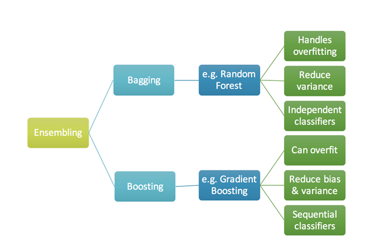
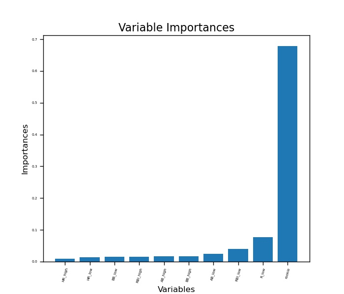

# Purpose

---

This work is a for fun and interest project for myself about baseball. I wanted to learn about what stats make non-pitchers 
more valuable than others. I also was curious who the most undervalued players of the past few decades are. I made and 
compared 4 different predictive strategies, 3 tree based models and a multiple linear regression. Then I used
the best model to get the importance weights and find the most underpaid players. There is a paper in this repo I have written up for this work.
More information about the project, models, etc. can all be found in it. 

# Data and Models

---

The main data for this project came from the Sean Lahman Baseball Database. This is a player stratified dataset that 
is comprehensive for all pro-baseball players from 1996 and on. There are points from before that period, but they are 
not reliable, so I did not use them. Additionally, I used data from the federal reserve to inflation adjust the salaries and 
allow for a more robust outcome. More data cleaning steps and procedures can be found in the cleaning folder and file. 

The main models this paper uses are a random forest, ada boost, and gradient boost. 

The below diagram gives a quick visualization of the difference in these techniques. A more thorough explanation of how
they work is given in the paper. 

A linear model was also made to give a comparison group for these other models. I was curious about the performance
difference for this problem. I did not write an explanation of how a regression works in the paper as it is not a focus
or point of interest here. Although, I did include a link that will walk through the math if the reader is interested. 
The same is true for a decision tree, since understanding how trees work is necessary to know how the boosting and bagging
methods function.

# Results

---

### Model Prediction Statistics
|Model | rMSE | R2 | 
|------|---------|-----------|
|Random Forest|.810 |.637|
|Ada Boost	|.850|	.600|
|Gradient Boost|	.791|	.654|
|Linear Regression|	.815|	.633|

The gradients boost has the best R2 and rMSE of all the models
this made it the choice pick for the importance weights and final table.

Rookie was by far the most important predictor of salary.

### Most Under Paid Players

|Player  | Year |Franchise Profit|
|----------|-------|-------------|
|Jorge Pasada|2000  |1.333237e+07|
|Tino Martinez|1996  |1.139209e+07|
|Scott Brosius|1998  |1.103016e+07|
|Bernie Williams|1996  |1.021768e+07|
|Ryan Ludwig|2008  |1.000333e+07|

The paper will go over these facts and figures as well as what they mean, more in depth than is done here. 

# References

---
1. "Download Lahman's Baseball Database." SeanLahman.com. February 16, 2021. Accessed April 25, 2021. http://www.seanlahman.com/baseball-archive/statistics/.
2. "Decision Tree Algorithm, Explained." KDnuggets. Accessed April 25, 2021. https://www.kdnuggets.com/2020/01/decision-tree-algorithm-explained.html.
3. Grover, Prince. "Gradient Boosting from Scratch." Medium. August 01, 2019. Accessed April 25, 2021. https://medium.com/mlreview/gradient-boosting-from-scratch-1e317ae4587d.
4. Fawagreh, Khaled, Mohamed Medhat Gaber, and Eyad Elyan. "Random forests: from early developments to recent advancements." Systems Science & Control Engineering: An Open Access Journal 2, no. 1 (2014): 602-609.
5. Freund, Yoav, and Robert E. Schapire. "A decision-theoretic generalization of on-line learning and an application to boosting." Journal of computer and system sciences 55, no. 1 (1997): 119-139.
6. "5.4 - A Matrix Formulation of the Multiple Regression Model." 5.4 - A Matrix Formulation of the Multiple Regression Model | STAT 462. Accessed April 25, 2021. https://online.stat.psu.edu/stat462/node/132/.
7. "Inflation, Consumer Prices for the United States." FRED. March 03, 2020. Accessed April 25, 2021. https://fred.stlouisfed.org/series/FPCPITOTLZGUSA.
8. Service Time: Glossary." MLB.com. Accessed April 25, 2021. https://www.mlb.com/glossary/transactions/service-time#:~:text=Upon reaching six years of,his free-agent seasons).

